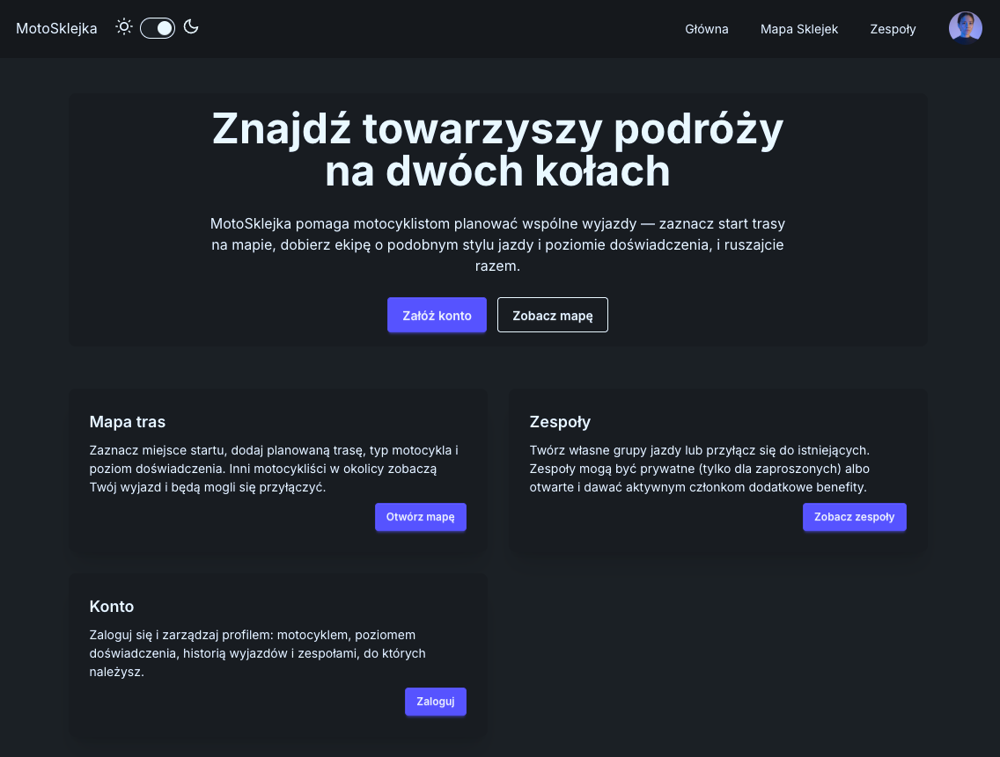
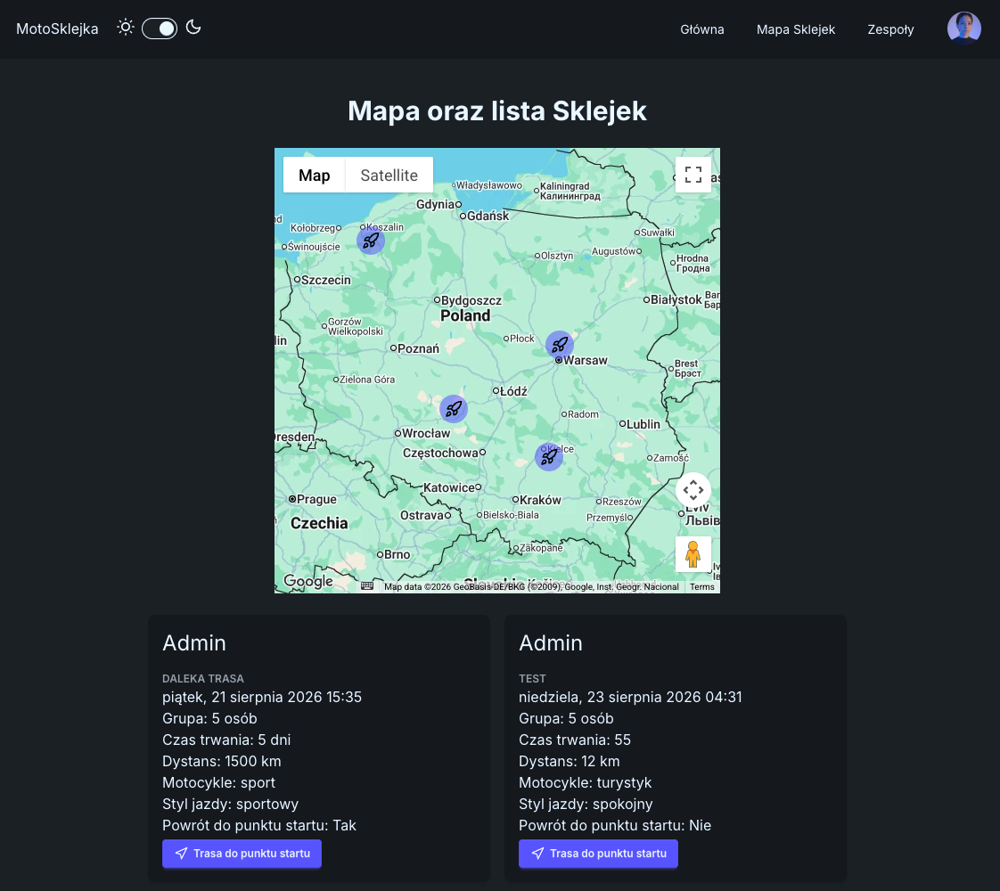
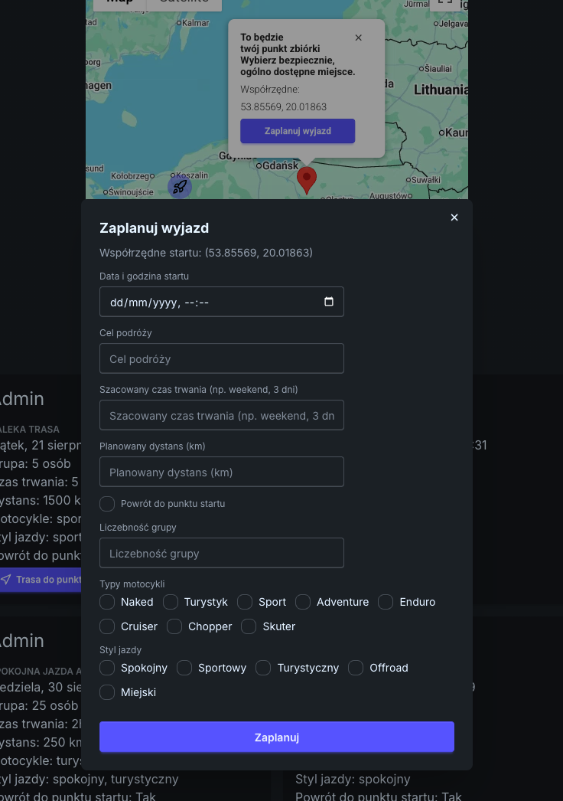
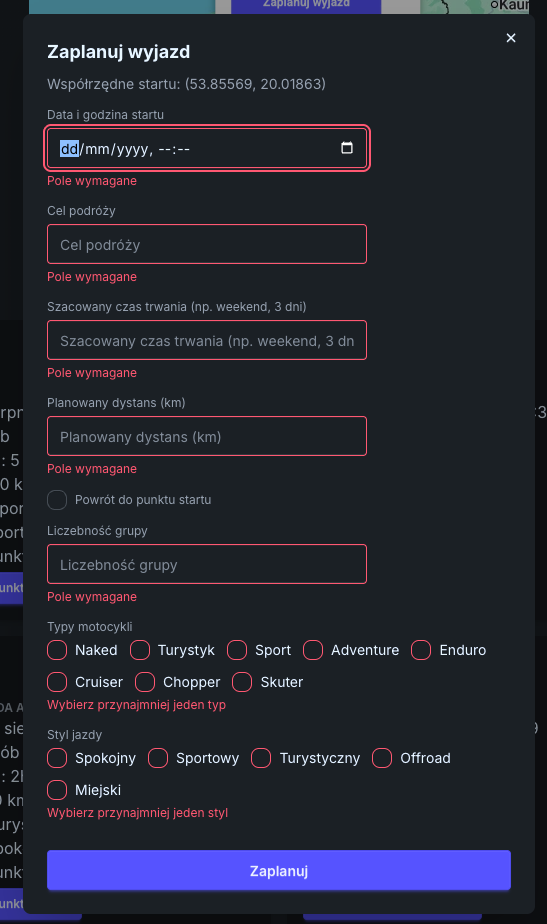
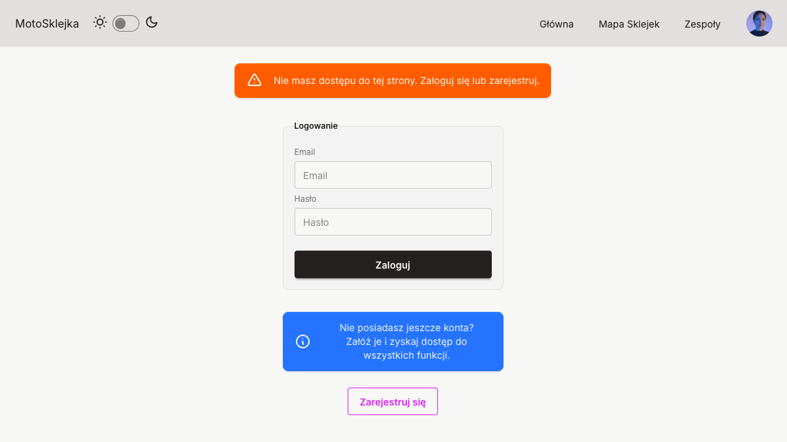
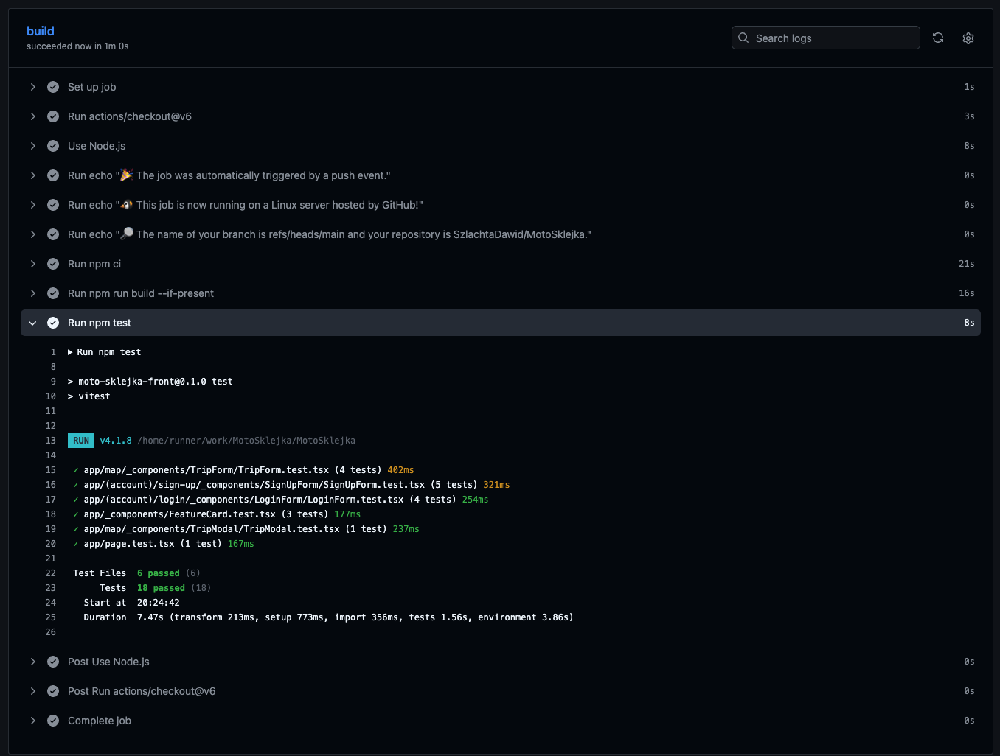
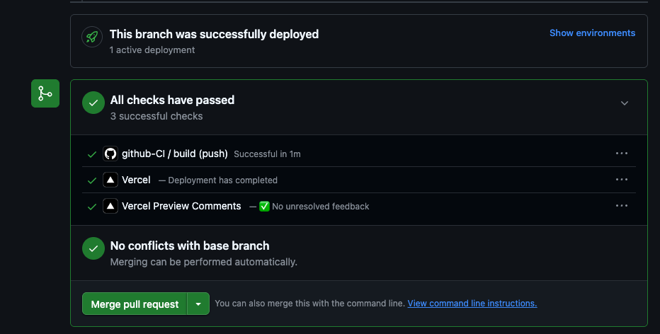

# MotoSklejka 🏍️

[](https://github.com/SzlachtaDawid/MotoSklejka/actions/workflows/github-CI.yml)

**A web app for motorcyclists to find riding companions for joint trips.** Pick a meeting point on the map, describe the trip, and other riders can find it and join.

> _"Sklejka"_ is Polish biker slang for riding together as a group. The app's UI is in Polish; this README and the codebase are in English.

**🔗 Live demo: [https://moto-sklejka-5ijck70q0-szlachta-97s-projects.vercel.app/](https://moto-sklejka-5ijck70q0-szlachta-97s-projects.vercel.app/)** &nbsp;•&nbsp; deployed on Vercel with a Neon serverless Postgres database.

<!-- SCREENSHOT: docs/screenshots/hero.png — the landing page or the map view, ideally with a few trip markers visible. This is the first thing a recruiter sees, so pick the most visually complete screen. -->



---

## Why I built this

This is a learning project, built deliberately rather than from a tutorial. I wanted hands-on experience with a modern full-stack setup end to end — not just the UI layer:

- **Next.js App Router** — understanding where the Server/Client Component boundary actually falls, and using **Server Actions** for mutations instead of hand-rolled API routes.
- **Prisma 7** — schema design, migrations, and the newer `prisma-client` generator that ships without the Rust query engine (which forces you to think about driver adapters).
- **Neon** — serverless Postgres, and what "serverless database" means in practice for connection handling.
- **Vercel** — the deployment pipeline, environment variables across environments, and preview deployments.
- **Authentication** — session handling with next-auth v5, password hashing, and route protection.
- **CI with GitHub Actions** — so that a broken build or a failing test never reaches the main branch.
- **Testing** — component tests with Vitest + Testing Library, particularly around form validation.

## Features

| Feature | Status | Notes |
| --- | --- | --- |
| Registration & login | ✅ Done | next-auth v5, Credentials provider, bcrypt hashing, JWT sessions |
| Trip map | ✅ Done | Google Maps; click anywhere to set a meeting point and plan a trip |
| Trip browsing | ✅ Done | Markers with details + a card list below the map, with a "Get directions" link |
| Anti-spam limits | ✅ Done | Two independent per-user limits enforced server-side |
| Protected routes | ✅ Done | Unauthenticated users are redirected to the login page with an explanation |
| Light/dark theme | ✅ Done | Persisted in `localStorage` |
| Teams | 🚧 Planned | Open/closed groups, shared trip planning, rankings, team chat |

### Screenshots

<!-- SCREENSHOT: docs/screenshots/map-view.png — the /map page: the Google map with several trip markers and the trip cards underneath. -->

**Trip map with the trip list**



<!-- SCREENSHOT: docs/screenshots/trip-form.png — the "Zaplanuj wyjazd" modal, open, with a few fields filled in and the checkbox groups visible. -->

**Planning a trip** — a modal form with client-side validation, submitted through a Server Action



<!-- SCREENSHOT: docs/screenshots/validation.png — the login or sign-up form showing red validation messages. Demonstrates the yup + react-hook-form wiring. -->

**Form validation**



<!-- SCREENSHOT: docs/screenshots/theme.png — ideally a side-by-side or split image of the same screen in light and dark theme. -->

**Light and dark theme**



## Tech stack

| Layer | Technology |
| --- | --- |
| Framework | Next.js 16 (App Router, Server Components, Server Actions) |
| UI | React 19, Tailwind CSS v4, daisyUI v5, lucide-react |
| Language | TypeScript |
| Auth | next-auth v5 (Credentials provider, JWT sessions), bcryptjs |
| ORM | Prisma 7 (`prisma-client` generator, ESM) |
| Database | Neon serverless Postgres via `@prisma/adapter-neon` |
| Forms | react-hook-form + yup (`@hookform/resolvers`) |
| Maps | `@vis.gl/react-google-maps` (Google Maps JavaScript API) |
| Testing | Vitest, Testing Library, jsdom |
| Tooling | ESLint (flat config), Prettier + `prettier-plugin-tailwindcss` |
| CI/CD | GitHub Actions, Vercel |

## Architecture

```
app/
├── (account)/                  # route group — does not affect URLs
│   ├── login/  sign-up/  account/
├── api/auth/[...nextauth]/     # next-auth route handlers
├── map/
│   ├── page.tsx                # async Server Component — fetches upcoming trips
│   ├── loading.tsx             # skeleton shown while the server renders
│   ├── actions.ts              # "use server" — createTrip() + rate limits
│   └── _components/            # MapView, TripMarker, TripsList, TripModal, TripForm
├── teams/                      # planned feature
├── _components/                # shared: NavBar, Providers, forms/ field components
├── lib/                        # db.ts (Prisma singleton), tripOptions.ts
auth.ts                         # next-auth config
proxy.ts                        # route protection (this version's middleware equivalent)
prisma/schema.prisma            # User + Trip models
```

**Data flow on `/map`:** the page is a Server Component that queries Postgres directly through Prisma and passes trips down as props. Creating a trip calls a Server Action, which re-checks the session and enforces the limits before writing, then the client triggers `router.refresh()` so the server re-renders with the new data. No client-side data fetching, no API layer in between.

**Forms** follow one consistent pattern, split into three files each: the component (markup only), a `useXForm` hook (react-hook-form wiring and submit handling), and a `schema.ts` (yup schema, types, defaults). Field components are shared and read the form context, so no form wires up a raw `<input>`.

## Testing

Component tests with Vitest and Testing Library, colocated next to the components. They focus on the forms, where most of the logic lives: rendering, validation messages, whether the Server Action gets called with the right payload, and how server-side errors are surfaced. Queries go through accessible roles and labels rather than test IDs.

```bash
npm test              # watch mode
npx vitest run        # single run (this is what CI does)
```



## CI

Every push runs the [GitHub Actions workflow](.github/workflows/github-CI.yml) on Node 24: install dependencies with `npm ci`, run a full production build, then run the test suite. The build step needs the database and auth variables, which are supplied from GitHub Secrets — so a broken build, a type error, or a failing test is caught before merging.

<!-- SCREENSHOT: docs/screenshots/ci.png — the Actions tab in GitHub showing a green workflow run, ideally with the job steps expanded. -->



## Running locally

**Requirements:** Node 24+, a Neon (or any) Postgres database, and a Google Maps API key.

```bash
git clone https://github.com/SzlachtaDawid/MotoSklejka.git
cd MotoSklejka
npm install

# environment variables — see the comments in both example files
cp .env.example .env               # DATABASE_URL (needed by the Prisma CLI and the app)
cp .env.local.example .env.local   # AUTH_SECRET, NEXT_PUBLIC_GOOGLE_MAPS_KEY_DEMO

npx prisma migrate dev             # apply migrations
npm run dev                        # http://localhost:3000
```

| Command | Description |
| --- | --- |
| `npm run dev` | Development server |
| `npm run build` / `npm start` | Production build / serve |
| `npm run lint` | ESLint |
| `npm test` | Vitest (watch mode) |
| `npx prisma generate` | Regenerate the Prisma client after schema changes |
| `npx prisma migrate dev` | Create and apply a migration |

## Roadmap

- **Teams** — open and closed groups, shared trip planning, rankings, team chat
- Server-side revalidation of form payloads in the Server Actions (currently client-side only)
- Editing and deleting your own trips
- Broader test coverage, including the Server Actions
- Reverse geocoding, so a meeting point shows an address instead of raw coordinates

---

Built by [Dawid Szlachta](https://github.com/SzlachtaDawid).
